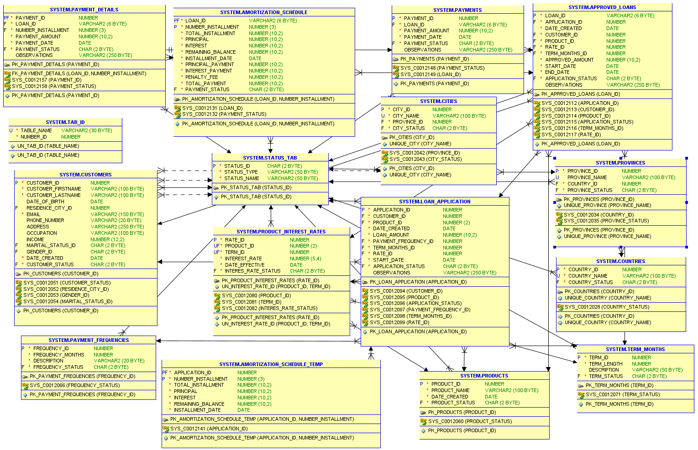

# Loan Management System

This project consists of creating a loan management system based on a relational database model. The system includes various tables and relationships to manage clients, products, approved loans, payments, and amortization details.

## Description

The system manages information related to loans requested by customers, their statuses, products related to loans, payment frequencies, and payments made. The main tables include:

- **TAB_ID**: Stores the names of tables created in the database along with their unique identifiers.
- **STATUS_TAB**: Contains different statuses for entities like countries, provinces, cities, and customers.
- **COUNTRIES**, **PROVINCES**, **CITIES**: Contain information related to countries, provinces, and cities.
- **CUSTOMERS**: Stores information about customers, including personal and contact details.
- **LOAN_APPLICATION**: Stores loan applications made by customers.
- **APPROVED_LOANS**: Contains the loans that have been approved.
- **AMORTIZATION_SCHEDULE**: Stores details about the amortization payments of approved loans.
- **PAYMENTS** and **PAYMENT_DETAILS**: Record payments made for approved loans.

### Relational Model

The relational database model is designed to ensure all tables are properly related through foreign keys, ensuring data integrity.



> The image of the relational model shows the created tables and their relationships.

## Folder Structure

- **model/**: Contains the `createTables.sql` script, which defines the database schema.
- **procedures/**: Stores individual SQL scripts for inserting and updating data using stored procedures.
- **functions/**: Contains SQL functions used for retrieving specific data from the database.

## Scripts

### **model/**
- `createTables.sql`: Script to create all necessary tables in the database.

### **procedures/**
- `insert_city.sql`: Procedure to insert cities.
- `insert_country.sql`: Procedure to insert countries.
- `insert_customer.sql`: Procedure to insert customers.
- `insert_payment_frequency.sql`: Procedure to insert payment frequencies.
- `insert_product.sql`: Procedure to insert products.
- `insert_product_interest_rate.sql`: Procedure to insert product interest rates.
- `insert_province.sql`: Procedure to insert provinces.
- `insert_status.sql`: Procedure to insert status values.
- `insert_term_months.sql`: Procedure to insert loan term months.
- `update_tab_ID.sql`: Procedure to update table identifiers.
- `crate_amortization_schedule_temp.sql: Procedure to create the amortization schedule.
- `insert_loan_application.sql: Procedure to insert the loan application

### **functions/**
- `fc_id_table.sql`: Function to retrieve the unique ID of a table from `tab_id`.
- `fc_rate_value.sql`: Function to get the interest rate value by `rate_id` from `product_interest_rates`.
- `fc_term_months_value.sql`: Function to retrieve the term length in months by `term_id` from `term_months`.
- `fc_payment_frequency_value.sql`: Function to extract the payment frequency in months by `frequency_id` from `payment_frequencies`.

## Usage

Run the scripts in the given order to set up the database and populate it with data. Ensure you have the necessary permissions before execution.


## Instructions

1. Clone the repository:
   ```bash
   git clone https://github.com/your-username/loan-management.git
